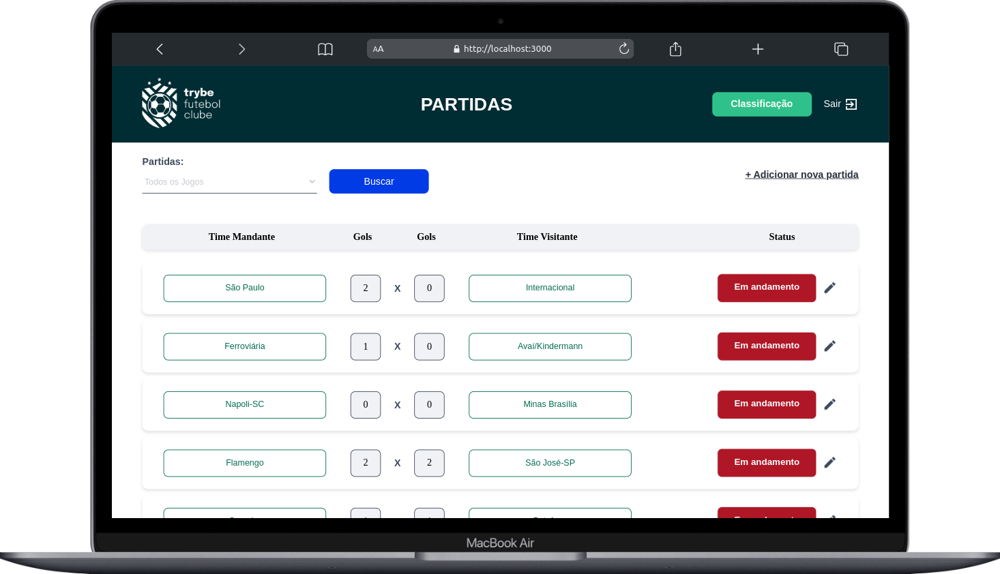
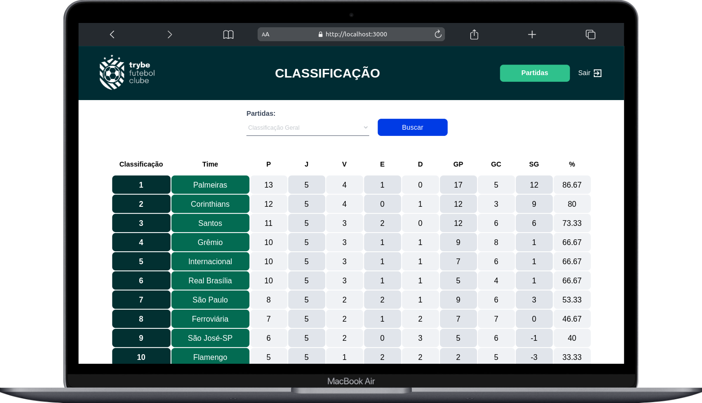

# Futebol Table ⚽

### O que foi desenvolvido

O Futebol Table é um site informativo sobre partidas e classificações de futebol! ⚽

No desenvolvimento do projeto TFC, fui responsável por implementar uma API utilizando a metodologia de desenvolvimento orientado por testes (TDD). Também atuei na integração das aplicações por meio do docker-compose, possibilitando a interação com um banco de dados.

Nesse projeto, foi construído **um back-end dockerizado utilizando modelagem de dados através do Sequelize**. O desenvolvimento **respeitou as regras de negócio** providas no projeto e **sua API é capaz de ser consumida por um front-end já provido nesse projeto**.

O back-end também implementa regras de negócio para popular adequadamente a tabela disponível no front-end que será exibida para a pessoa usuária do sistema.

### Estrutura do projeto

O projeto é composto de 4 entidades importantes para sua estrutura:

1️⃣ **Banco de dados:**

- É um container docker MySQL já configurado no docker-compose através de um serviço definido como `db`.
- Tem o papel de fornecer dados para o serviço de *backend*.
- É possível conectar a um Cliente MySQL (Workbench, Beekeeper, DBeaver e etc), colocando as credenciais configuradas no docker-compose no serviço `db`.

2️⃣ **Back-end:**

- É o ambiente que você realizará a maior parte das implementações exigidas.
- Deve rodar na porta `3001`, pois o front-end faz requisições para ele nessa porta por padrão;
- O `express` é executado e a aplicação ouve a porta que vem das variáveis de ambiente;

3️⃣ **Front-end:**

- O front se comunica com serviço de back-end pela url `http://localhost:3001` através dos endpoints.

4️⃣ **Docker:**

- O `docker-compose` tem a responsabilidade de unir todos os serviços conteinerizados (backend, frontend e db) e subir o projeto completo com o comando `npm run compose:up`;
- O arquivo `docker-compose.yml` também pode ser utilizado para executar a aplicação na máquina local, para isso é necessário executar o comando `npm run compose:up` na raiz do projeto.

### **🔐 Criptografia de senhas**

<aside>
⚠️ A biblioteca utilizada para criptografar as senhas no banco de dados é a [bcryptjs npm](https://github.com/dcodeIO/bcrypt.js), a qual já vem instalada no projeto e não deve ser alterada ou substituída. Recomendamos que explore os recursos da biblioteca na documentação para implementá-la no projeto durante o processo de login.

</aside>

### **🎲 Sequelize**

Para o desenvolvimento, o time de produto disponibilizou um *Diagrama de Entidade-Relacionamento (DER)* para construir a modelagem do banco de dados.

<aside>
⚠️ O `package.json` do diretório `app/backend` contém um script `db:reset` que é responsável por "dropar" o banco, recriar e executar as *migrations* e *seeders*. Você pode executá-lo dentro do container de backend com o comando `npm run db:reset` se por algum motivo precisar recriar a base de dados;

</aside>

### **⚙️** Instalação

• Ao rodar o comando `npm install` na pasta raiz do projeto você estará **instalando somente as dependências para rodar os requisitos do projeto**;

• Cada diretório (`frontend` e `backend`) possui suas próprias dependências - você pode instalá-las de forma rápida rodando o comando `npm run install:apps` na pasta raiz do projeto, ou rodando `npm install` dentro de cada diretório;

• O front se comunica com serviço de back-end pela url http://localhost:3001 através dos endpoints. Basta acessar no seu computador para ver a aplicação rodando.

### Requisitos

- **Fluxo 1**
    
    ### **Fluxo 1: Teams (Times)Introdução**
    
    • Os requisitos a seguir consideram o consumo da rota `/teams` para retornar os nomes dos times associados à partida na renderização do front-end**Requisitos
    1 - Desenvolva em `/app/backend/src/database` nas pastas correspondentes, uma migration e um model para a tabela de times**
    
    **2 - (`TDD`) Desenvolva testes que cubram no mínimo 5 por cento dos arquivos em `/app/backend/src`, com um mínimo de 7 linhas cobertas**
    
    **3 - Desenvolva o endpoint `/teams` no back-end de forma que ele possa retornar todos os times corretamente**
    
    **4 - (`TDD`) Desenvolva testes que cubram no mínimo 10 por cento dos arquivos em `/app/backend/src`, com um mínimo de 19 linhas cobertas**
    
    **5 - Desenvolva o endpoint `/teams/:id` no back-end de forma que ele possa retornar dados de um time específico**
    
- **Fluxo 2**
    
    ### **Fluxo 2: Users e Login (Pessoas Usuárias e Credenciais de acesso)Introdução**
    
    • A rota utilizada deve ser (`/login`);
    • A rota deve receber os campos `email` e `password` e esses campos devem ser validados no banco de dados:
        ◦ O campo `email` deve receber um email válido. Ex: `tfc@projeto.com`;
        ◦ O campo `password` deve ter mais de 6 caracteres.
        ◦ Além de válidos, é necessário que o email e a senha estejam cadastrados no banco para ser feito o login;
    • O body da requisição deve conter o seguinte formato:
    
    `{
      "email": "string",
      "password": "string"
    }`
    
- **Requisitos Fluxo 2**
    
    ### **Requisitos**
    
    **6 - Desenvolva em `/app/backend/src/database` nas pastas correspondentes, uma migration e um model para a tabela de pessoas usuárias**
    
    **7 - (`TDD`) Desenvolva testes que cubram no mínimo 15 por cento dos arquivos em `/app/backend/src`, com um mínimo de 25 linhas cobertas**
    
    **8 - Desenvolva o endpoint `/login` no back-end de maneira que ele permita o acesso com dados válidos no front-end**
    
    **9 - (`TDD`) Desenvolva testes que cubram no mínimo 20 por cento dos arquivos em `/app/backend/src`, com um mínimo de 35 linhas cobertas**
    
    **10 - Desenvolva o endpoint `/login` no back-end de maneira que ele não permita o acesso com um email não cadastrado ou senha incorreta no front-end**
    
    **11 - (`TDD`) Desenvolva testes que cubram no mínimo 30 por cento dos arquivos em `/app/backend/src`, com um mínimo de 45 linhas cobertas**
    
    **12 - Desenvolva um middleware de validação para o `token`, verificando se ele é válido, e desenvolva o endpoint `/login/role` no back-end de maneira que ele retorne os dados corretamente no front-end**
    
- **Fluxo 3**
    
    ### **Fluxo 3: Matches (Partidas)Introdução**
    
    • Para os requisitos de criação de partidas, será necessário implementar o model e algumas rotas relacionadas a entidade Match.
    • A partir do **requisito 17** até o **requisito 21** serão feitas validações de token:
        ◦ Caso o token não seja informado, deve-se retornar, com um status `401`, a seguinte mensagem:
    
    `{ "message": "Token not found" }`
    • Será validado que não é possível alterar uma partida com um token inválido;
        ◦ Caso o token informado não seja válido, deve-se retornar, com um status `401`, a seguinte mensagem:
    
    `{ "message": "Token must be a valid token" }`
    
- **Requisitos Fluxo 3**
    
    ### **Requisitos**
    
    **13 - Desenvolva em `/app/backend/src/database` nas pastas correspondentes, uma migration e um model para a tabela de partidas**
    
    **14 - (`TDD`) Desenvolva testes que cubram no mínimo 45 por cento dos arquivos em `/app/backend/src`, com um mínimo de 70 linhas cobertas**
    
    **15 - Desenvolva o endpoint `/matches` de forma que os dados apareçam corretamente na tela de partidas no front-end**
    
    **16 - Desenvolva o endpoint `/matches` de forma que seja possível filtrar somente as partidas em andamento, e também filtrar somente as partidas finalizadas, na tela de partidas do front-end**
    
    **17 - Desenvolva o endpoint `/matches/:id/finish` de modo que seja possível finalizar uma partida no banco de dados**
    • A rota deve ser do tipo `PATCH`;
    • Será recebido o `id` pelo parâmetro da URL;
    • Será validado que não é possível alterar uma partida sem um token;
        ◦ Confira a resposta esperada na introdução dessa seção.
    • Será validado que, ao finalizar uma partida, a alteração é feita no banco de dados e na página.
    • Deve-se retornar, com um status `200`, a seguinte mensagem:
    
    `{ "message": "Finished" }`
    **18 - Desenvolva o endpoint `/matches/:id` de forma que seja possível atualizar partidas em andamento**
    
    **19 - (`TDD`) Desenvolva testes que cubram no mínimo 60 por cento dos arquivos em `/app/backend/src`, com um mínimo de 80 linhas cobertas**
    
    **20 - Desenvolva o endpoint `/matches` de modo que seja possível cadastrar uma nova partida em andamento no banco de dados**
    
    **21 - Desenvolva o endpoint `/matches` de forma que não seja possível inserir uma partida com times iguais nem com um time que não existe na tabela de times**
    
- **Fluxo 4**
    
    ### **Fluxo 4: Leaderboards (Placares)Introdução**
    
    ▶️ Para construir a classificação dos times, devem ser seguidas as seguintes regras de negócios:
    
    `- `Classificação`: Posição na classificação;
    - `Time`: Nome do time;
    - `P`: Total de Pontos;
    - `J`: Total de Jogos;
    - `V`: Total de Vitórias;
    - `E`: Total de Empates;
    - `D`: Total de Derrotas;
    - `GP`: Gols marcados a favor;
    - `GC`: Gols sofridos;
    - `SG`: Saldo total de gols;
    - `%`: Aproveitamento do time.`
    
    • Todas as regras de negócio e cálculos necessários deverão ser realizados no seu back-end. A aplicação front-end - que já está pronta - apenas renderizará essas informações.
    • Para calcular o `Total de Pontos`, você deve levar em consideração que:
        ◦ O time `vitorioso`: marcará +3 pontos;
        ◦ O time `perdedor`: marcará 0 pontos;
        ◦ Em caso de `empate`: ambos os times marcam +1 ponto.
    • Para o campo `Aproveitamento do time (%)`, que é a porcentagem de jogos ganhos, use a seguinte fórmula: `[P / (J * 3)] * 100`, onde:
        ◦ `P`: Total de Pontos;
        ◦ `J`: Total de Jogos.
    Obs.: O seu resultado deverá ser limitado a `duas casas decimais`.
    • Para calcular `Saldo de Gols` use a seguinte fórmula: `GP - GC`, onde:
        ◦ `GP`: Gols marcados a favor;
        ◦ `GC`: Gols sofridos.
    • O resultado deverá ser ordenado sempre de forma decrescente, levando em consideração a quantidade de pontos que o time acumulou. Em caso de empate no `Total de Pontos`, você deve levar em consideração os seguintes critérios para desempate:
    
    **Ordem para desempate**
    • 1º Total de Vitórias;
    • 2º Saldo de gols;
    • 3º Gols a favor;
    
    ⚠️ **Atenção:** ⚠️
    • Por padrão, as respostas de todos os seus endpoints deverão estar em inglês, mesmo que a renderização no front-end seja em português.
    • A sua tabela deverá renderizar **somente** as PARTIDAS que já foram FINALIZADAS! **Os seguintes pontos serão avaliados:**
    
    `- Se a lista de classificação está correta;
    - Se a regra de classificação se mantém mesmo com mudanças na classificação;
    - Se a tabela de classificação tem 10 colunas;
    - Se a tabela tem uma linha para cada time.`
    
    **Exemplo de retorno esperado:**
    
    `[
      {
        "name": "Palmeiras",
        "totalPoints": 13,
        "totalGames": 5,
        "totalVictories": 4,
        "totalDraws": 1,
        "totalLosses": 0,
        "goalsFavor": 17,
        "goalsOwn": 5,
        "goalsBalance": 12,
        "efficiency": 86.67
      },
      {
        "name": "Corinthians",
        "totalPoints": 12,
        "totalGames": 5,
        "totalVictories": 4,
        "totalDraws": 0,
        "totalLosses": 1,
        "goalsFavor": 12,
        "goalsOwn": 3,
        "goalsBalance": 9,
        "efficiency": 80
      },
      {
        "name": "Santos",
        "totalPoints": 11,
        "totalGames": 5,
        "totalVictories": 3,
        "totalDraws": 2,
        "totalLosses": 0,
        "goalsFavor": 12,
        "goalsOwn": 6,
        "goalsBalance": 6,
        "efficiency": 73.33
      },
      ...
    ]`
    • Os endpoints dessa seção, irão alimentar uma tabela idêntica ao exemplo abaixo no front-end:ClassificaçãoTimePJVEDGPGCSG%1Ferroviária3815122144133184.4
    
- **Requisito Fluxo 4**
    
    **Requisitos
    22 - (`Bônus`; `TDD`) Desenvolva testes que cubram no mínimo 80 por cento dos arquivos em `/app/backend/src`, com um mínimo de 100 linhas cobertas**
    
    **23 - Desenvolva o endpoint `/leaderboard/home` de forma que retorne as informações do desempenho dos times da casa com as seguintes propriedades: `name`, `totalPoints`, `totalGames`, `totalVictories`, `totalDraws`, `totalLosses`, `goalsFavor` e `goalsOwn`**
    
    **24 - Desenvolva o endpoint `/leaderboard/home` de forma que seja possível filtrar as classificações dos times da casa na tela de classificação do front-end com os dados iniciais do banco de dados, incluindo as propriedades `goalsBalance` e `efficiency`, além das propriedades do requisito anterior**
    
    **25 - Desenvolva o endpoint `/leaderboard/home` de forma que seja possível filtrar as classificações dos times da casa na tela de classificação do front-end, e atualizar a tabela ao inserir a partida Corinthians 2 X 1 Internacional**
    
    **26 - Desenvolva o endpoint `/leaderboard/away` de forma que retorne as informações do desempenho dos times visitantes com as seguintes propriedades: `name`, `totalPoints`, `totalGames`, `totalVictories`, `totalDraws`, `totalLosses`, `goalsFavor` e `goalsOwn`**
    
    **27 - Desenvolva o endpoint `/leaderboard/away`, de forma que seja possível filtrar as classificações dos times quando visitantes na tela de classificação do front-end, com os dados iniciais do banco de dados, incluindo as propriedades `goalsBalance` e `efficiency`, além das propriedades do requisito anterior**
    
    **28 - Desenvolva o endpoint `/leaderboard/away` de forma que seja possível filtrar as classificações dos times quando visitantes na tela de classificação do front-end e atualizar a tabela ao inserir a partida Corinthians 2 X 1 Internacional**
    
    **29 - Desenvolva o endpoint `/leaderboard` de forma que seja possível filtrar a classificação geral dos times na tela de classificação do front-end com os dados iniciais do banco de dados**
    
    **30 - (`Bônus`) Desenvolva o endpoint `/leaderboard` de forma que seja possível filtrar a classificação geral dos times na tela de classificação do front-end e atualizar a tabela ao inserir a partida Flamengo 3 X 0 Napoli-SC**